# TeamLaunch — Team Formation, Idea Validation & Competition Tracker

TeamLaunch is an all-in-one workspace built for developer & student hackathon teams to form rosters, track competition deadlines, run automated eligibility & submission completeness audits, research prior academic art via Semantic Scholar & OpenAlex, draft pitch decks with per-slide rewrite checklists, analyze PPTX file structures, and receive daily push notifications via a Telegram Digest Bot with subscription gating.

---

## Tech Stack

- **Backend**: Node.js + Express + SQLite (zero-config local DB) / PostgreSQL fallback + ioredis + node-cron + pptxgenjs + adm-zip
- **Frontend**: React + Vite + TailwindCSS
- **Design System**: Ethereal Glass SaaS Archetype (`#0A0A0A` background, Outfit & Geist typography, double-bezel cards, desaturated cyan-emerald accent `#00E599` / `#00F0FF`, tabular numeric countdowns)
- **Auth**: JWT Authentication
- **Integrations**: Telegram Bot API, Semantic Scholar Graph API, OpenAlex API, Anthropic API (Claude 3.5 Sonnet)

---

## Quick Start (Local Development)

### 1. Install & Run Backend
```bash
cd backend
npm install
npm run dev
# Running on http://localhost:5000
```

### 2. Install & Run Frontend
```bash
cd frontend
npm install
npm run dev
# Running on http://localhost:3000
```

### 3. Docker Compose Setup (Optional)
```bash
docker-compose up --build
```

---

## Core Modules & Features

1. **Onboarding & Profile**: Multi-step registration with education details, skills array, portfolio/resume links, and phone.
2. **Team Formation**: Invite code generation, roster display, leader re-assignment, and leader point-of-contact phone storage.
3. **Competition Tracker**: Manual Kanban board (Saved → In Progress → Applied → Result). Launch official link in new tab. Tabular monospace countdown timers with pulsing alert dot for deadlines < 48 hours.
4. **Eligibility & Completeness Checker**: Evaluates raw competition rules against team members (size, student status, college) and submission completeness (problem, solution, tech stack, deck). Returns exact `met` / `missing` / `borderline` status badges tied to rule text.
5. **Idea Novelty Lookup**: Queries Semantic Scholar Graph API and OpenAlex for prior academic papers (top 3 closest works matrix) and synthesizes key technical differentiators.
6. **AI Pitch Deck Studio & Prep Guide**: Drafts slide outlines with speaker notes and per-slide rewrite checklists. Exports native `.pptx` presentations using `pptxgenjs`. Generates judge Q&A and countdown execution timelines.
7. **PPT Structural Checker**: Drag-and-drop PPTX file upload analyzer (`adm-zip` + XML parser) evaluating slide counts, text density per slide (>100 words), and section presence.
8. **Subscription Gating & Telegram Digest**: 1st competition application free per team; 2nd+ application requires Pro subscription (Razorpay / Stripe mock checkout). Triggers Telegram Bot API link flow for daily push digests.

---

## Screenshots Gallery

All section screenshots are available in the [`sc/`](./sc) folder:

| Section | Preview |
|---|---|
| **Landing Page** |  |
| **Auth Page** | 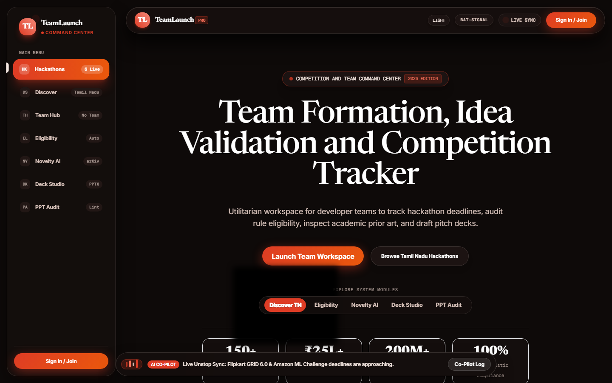 |
| **Discover Feed** | 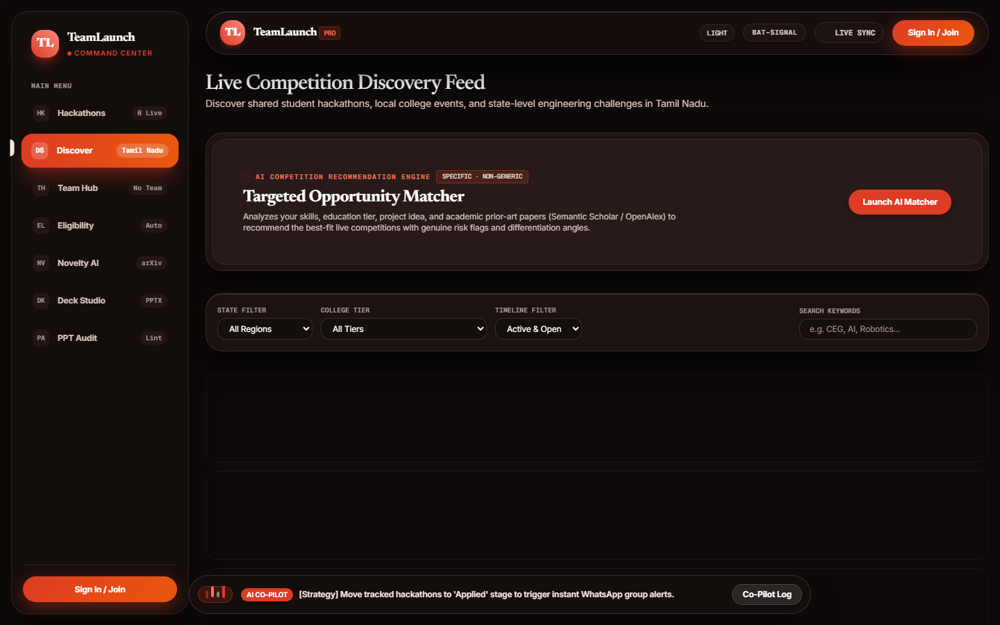 |
| **Eligibility Engine** | 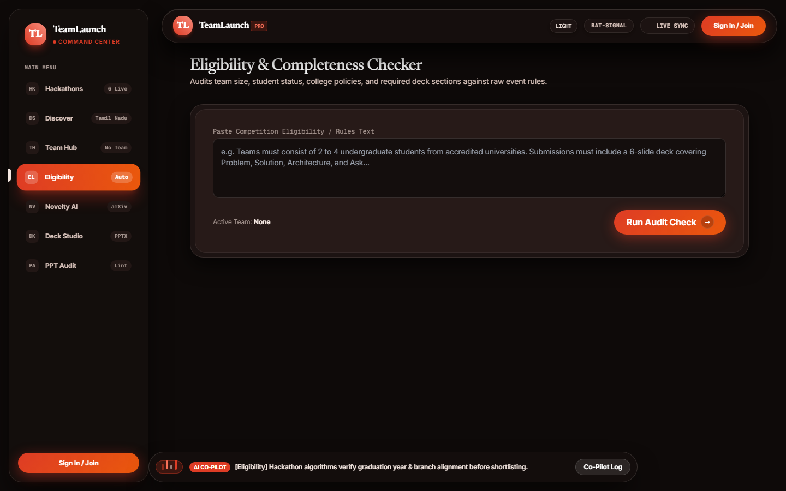 |
| **Novelty AI & Prior-Art** | 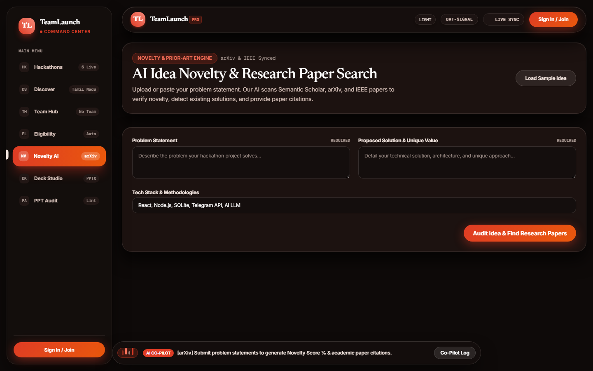 |
| **Pitch Deck Studio** |  |
| **PPT Structural Audit** | 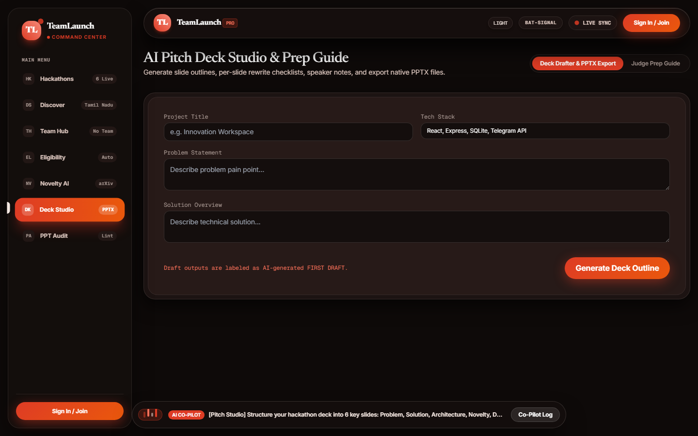 |
| **Hackathon Progress Board** | 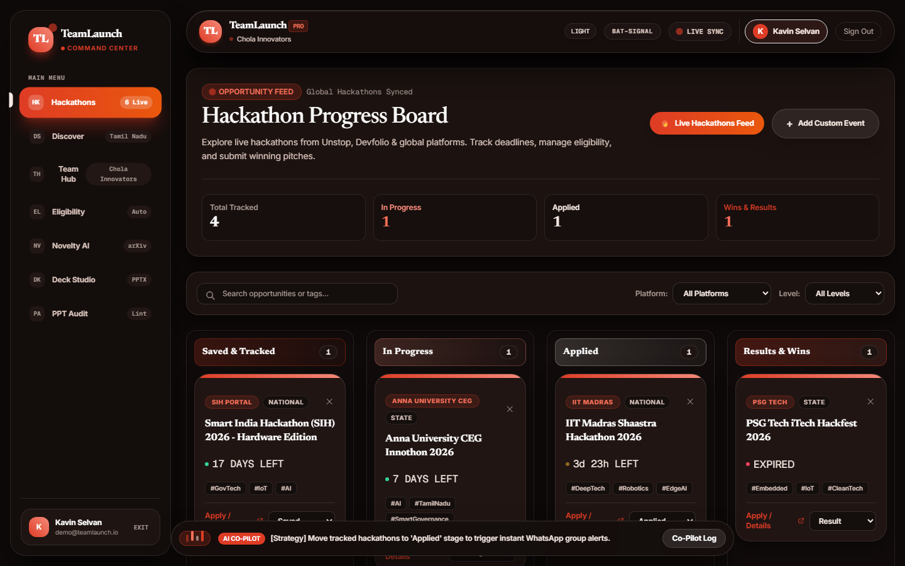 |
| **Team Roster Hub (Tamil Team)** | 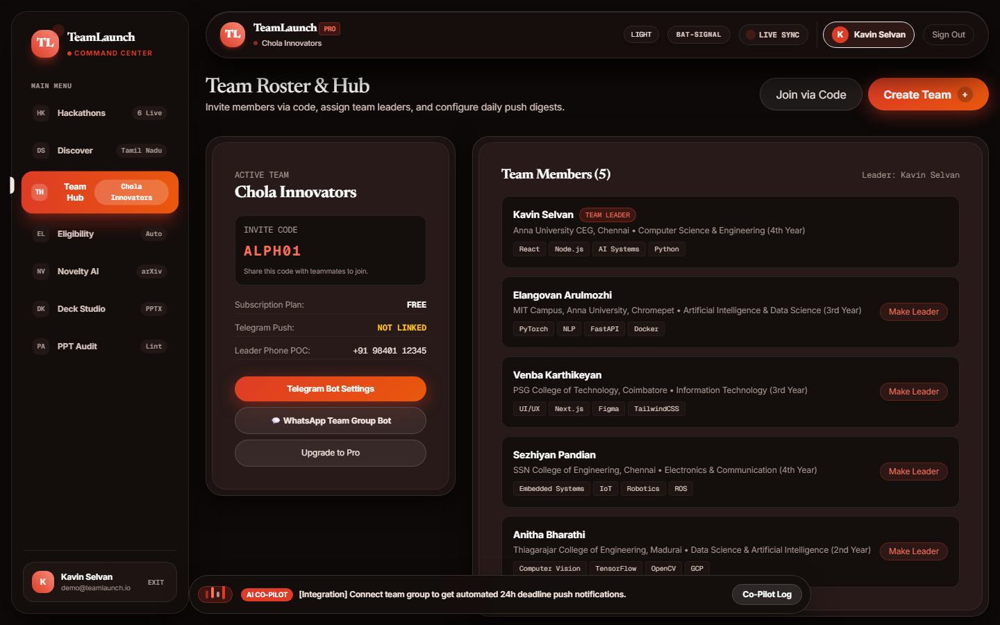 |
| **Batman Intro Symbol** | 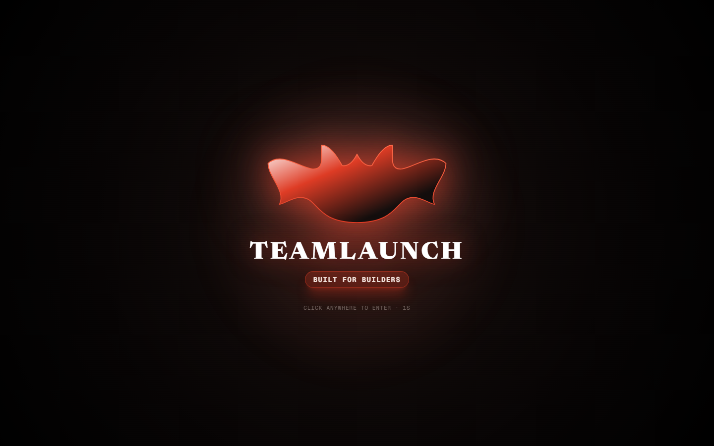 |
| **Mobile Hamburger Badge** | 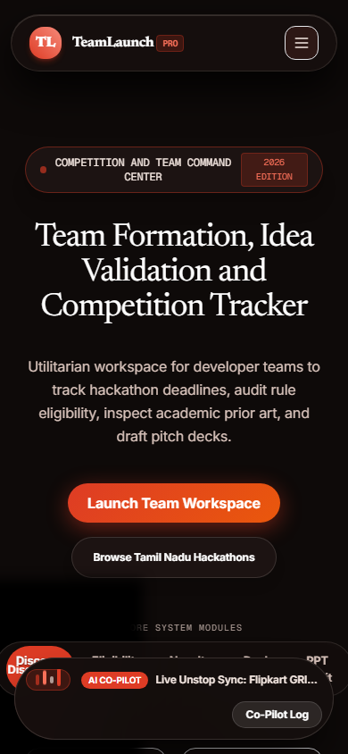 |
| **Mobile Hamburger Menu Opened** | 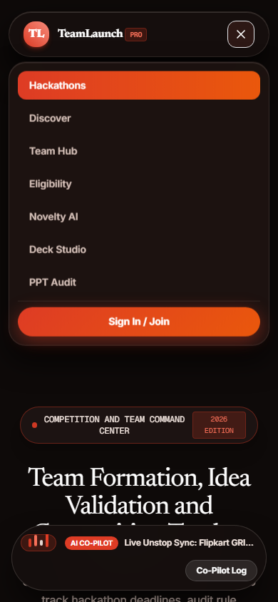 |
| **Lead Developer HM Badge** | 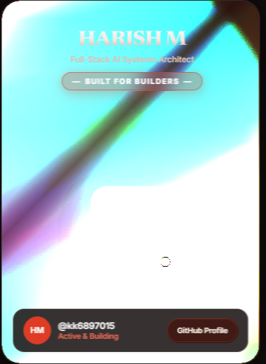 |
| **Glowing Bat-Signal Emblem** |  |


